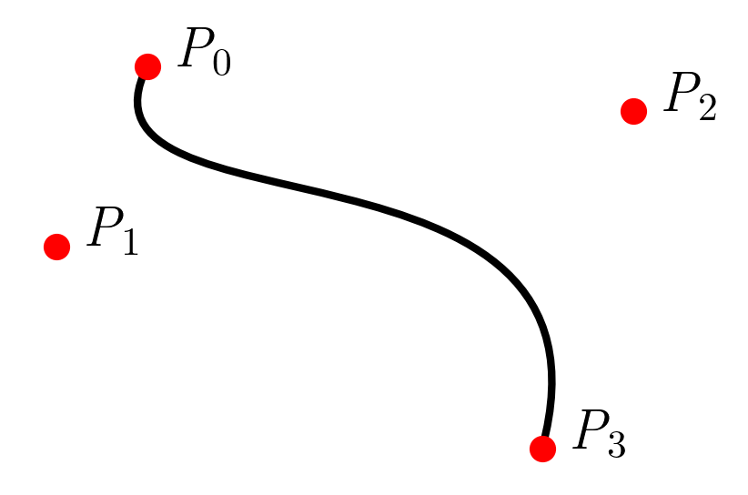
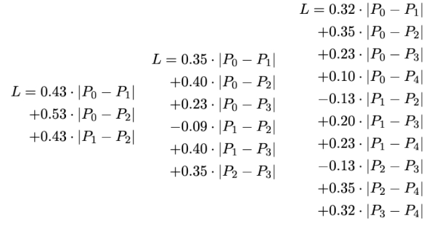

# Approximation of a Bézier Curve length 

## Description
Jupyter notebooks that builds a formulae to approximate the length of [Bézier curves](https://en.wikipedia.org/wiki/Bézier_curve) without calculating the curves. One file each for three, four and five control points, and two and three dimensions.

I put most attention into four points and 2D. In this case I added a version in Decimal and with symmetrical fitting. Consider the other cases just drafts, the 3D models aren’t tested with real data. I’ve tried fits with polynomials as well but that just lead to overfitting.

The purpose of this is on the one hand submitting it as part of a paper for my university study and on the other hand optimizing 
[my OpenSCAD Bézier Curve code](https://benjaminwand.github.io/verbose-cv/projects/bezier_curves.html). 

[There is a blogpost with some explanations.](https://benjaminwand.github.io/verbose-cv/projects/length_bezier.html) 

## Requirements
* [Jupyter notebook](https://www.studytonight.com/post/how-to-install-jupyter-notebook-without-anaconda-on-windows)
* Python 3.12.7
* numpy, pandas, matplotlib, sklearn, mpl_toolkits (3d files), cvxpy (symmetrical file), decimal (decimal file)

## Process
1. Create Bézier curves from random points. Those curves look wild.
2. Run linear regression with the distances of the points as x and the length as y. This made the formulae below.
3. (Only in the 2d files:) test model on curves of my former design projects ([cookie cutters](https://github.com/benjaminwand/cookie-cutters)). Works fine / good prediction. (I don’t have test data for the 3d models.)

## Spoiler
Given a curve with points labeled as such:

The formula for curves with three, four and five control points are:
